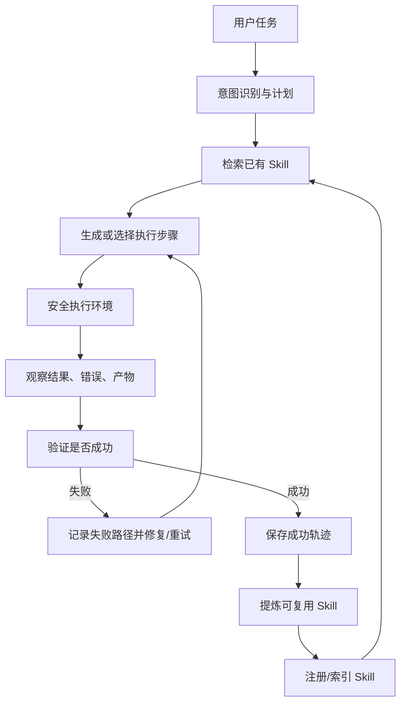

# 个人学习笔记：成熟 Agent 项目如何实现自学习 Skill 与安全代码执行

> 这份文档只面向个人学习，重点解释成熟 Agent 项目的工程思路，并映射到 PubHAgent 当前实现。它不是对外宣传文案，也不是安全审计报告。

## 1. 总览

成熟 Agent 项目通常把“自学习进化”和“安全代码执行”拆成两条互相配合的主线：

1. **自学习 Skill 主线**：把一次任务的成功路径、失败路径、修复动作、验证规则记录为轨迹；当相似任务多次成功后，把稳定流程沉淀成 `SKILL.md`、脚本模板或工具说明；后续任务先检索 Skill，再按需加载细节。
2. **安全执行主线**：任何由模型生成的代码、命令、文件操作都不能直接在宿主机裸奔；需要隔离环境、资源限制、路径边界、超时、中断、审计日志、结果回传。

成熟实现不是“让模型自己想办法变聪明”，而是搭建一个工程闭环：



## 2. 成熟项目的参考做法

### 2.1 Hermes Agent：从轨迹到 Skill

Hermes Agent 的学习循环可以概括为：

- **Observe**：记录多步骤任务中的工具调用、决策分支、用户修正和执行结果。
- **Distill**：当相似任务模式稳定成功后，把过程提炼成 `SKILL.md`。
- **Reuse**：Skill 进入本地技能目录，后续相似任务可被检索和复用。
- **Refine**：发现更好流程时，Agent 可以更新已有 Skill。

Hermes 还强调 **progressive disclosure**：系统先只看 Skill 的轻量元信息，只有任务匹配时才加载完整 `SKILL.md`。这样不会因为 Skill 越来越多而把上下文窗口塞满。

参考资料：[Hermes Learning Loop](https://hermes-agent.ai/features/learning-loop)

### 2.2 AutoGen Studio：可观察的多 Agent 工作流

AutoGen Studio 的成熟点不只是会执行任务，而是把任务过程暴露给开发者观察：

- 可以定义 agent、skills/tools、memory、workflow。
- Playground 里可以运行任务、观察 agent 消息、动作、产物。
- Profiler 视图统计消息、成本、工具调用成功/失败等指标。
- 支持 Docker 作为代码执行安全环境。

这给我们的启发是：自学习系统必须可观察。否则你不知道 Skill 是怎么学出来的，也不知道失败是模型问题、数据问题、工具问题还是沙箱问题。

参考资料：[AutoGen Studio Paper](https://www.microsoft.com/en-us/research/uploads/prod/2024/08/AutoGen_Studio-12.pdf)

### 2.3 OpenHands：代码执行放进 Sandbox/Runtime

OpenHands 把执行代码、编辑文件、启动服务的环境称为 sandbox。它支持不同 provider：

- Docker sandbox：推荐，有较好宿主机隔离。
- Process sandbox：速度快，但没有容器隔离，不安全。
- Remote sandbox：远程环境，适合托管部署。

它的运行时架构是后端与容器内执行服务通信：后端发送 action，sandbox 内执行 action，再返回 observation。成熟点在于把“Agent 推理”和“代码执行”分层，中间通过结构化 action/observation 通信。

参考资料：

- [OpenHands Sandbox Overview](https://docs.openhands.dev/openhands/usage/sandboxes/overview)
- [OpenHands Runtime Architecture](https://docs.openhands.dev/openhands/usage/architecture/runtime)

### 2.4 E2B：托管隔离代码解释器

E2B 的 Code Interpreter 提供云端隔离 sandbox，可以运行代码、命令和文件操作，并通过 SDK 回传 stdout、stderr、result、error 等。它的核心启发是：

- 每次执行都有明确 sandbox 对象。
- 代码执行支持输出回调、错误回调、超时。
- 文件读写在 sandbox 内完成，而不是直接操作宿主机。

参考资料：[E2B Code Interpreter SDK](https://e2b.dev/docs/sdk-reference/code-interpreter-python-sdk/v2.5.0/code_interpreter)

## 3. 自学习 Skill 的成熟工程模式

### 3.1 Skill 不是提示词片段，而是“可验证流程”

一个成熟 Skill 至少包含：

- **适用场景**：什么时候用它。
- **输入要求**：需要哪些数据、文件、字段、上下文。
- **前置检查**：数据是否存在、字段是否满足、依赖是否可用。
- **执行步骤**：稳定的分析流程或工具调用顺序。
- **失败处理**：常见错误、修复方式、重试策略。
- **验证规则**：怎样判断结果真的成功。
- **输出约定**：报告、结构化 JSON、图表、日志、产物路径。
- **限制条件**：不能推断什么，不能替代什么专业结论。

也就是说，Skill 的价值不只是“告诉模型怎么做”，而是把一次成功经验变成可验证、可复用、可维护的工程资产。

### 3.2 学习闭环的关键数据结构

推荐把一次任务轨迹拆成三类记录：

```text
AnalysisTrajectory
├── user_query              用户原始目标
├── intent                  识别出的任务类型
├── data_files              输入数据文件
├── plan_summary            计划摘要
├── attempts[]              每次执行尝试
├── validation              验证结果
├── learned_skill           生成或更新的 Skill
└── created_at              时间戳

AttemptRecord
├── step_id
├── description
├── code
├── output
├── error
├── success
└── artifacts

ValidationRecord
├── passed
├── checks[]
└── issues[]
```

这里最重要的是 **失败路径也要记录**。成熟项目不会只保存成功代码，因为失败路径能帮助系统下次避坑。

### 3.3 什么时候生成 Skill

不要每次成功都无脑生成 Skill。成熟策略通常有门槛：

- 单次任务必须通过验证。
- 产物必须存在且非空。
- 代码不能触发安全策略。
- 输入/输出模式有可泛化价值。
- 最好出现多次相似成功后再固化。

Hermes 的学习循环提到相似任务多次成功后进入提炼阶段。PubHAgent 当前版本为了先跑通闭环，采用“单次成功即可生成 learned Skill”的实现；后续可以升级为“多次相似成功才稳定晋级”。

### 3.4 Skill 检索与渐进加载

成熟项目不会把所有 Skill 全量塞进系统提示词，而是做两级加载：

1. **轻量索引层**：只加载 Skill 名称、描述、分类、标签、能力边界。
2. **按需详情层**：当用户任务匹配时，再加载完整 `SKILL.md`。

这样有三个好处：

- 控制上下文成本。
- 降低无关 Skill 干扰。
- Skill 数量增长后仍能工作。

在 PubHAgent 中，可以把 `backend/tools/skills/registry.py` 继续增强成轻量索引服务，并让 Planner 只拿 top-k Skill 的完整内容。

## 4. 安全代码执行的成熟工程模式

### 4.1 安全执行的分层

成熟系统通常至少有四层防线：

```text
模型生成代码
    ↓
静态策略检查
    ↓
执行前授权与路径映射
    ↓
隔离执行环境
    ↓
运行时限制：超时、资源、网络、文件系统
    ↓
结构化 observation 回传
    ↓
审计与轨迹记录
```

任何单层都不够安全。例如：

- 只做提示词约束，不安全。
- 只做静态扫描，不足以防运行时行为。
- 只用容器，不等于可以放开所有权限。
- 只限制路径，不等于能防子进程、网络、环境变量泄漏。

### 4.2 Docker/远程 Sandbox 优先，本地受限执行兜底

成熟项目一般会把执行环境分级：

| 执行方式 | 安全性 | 速度 | 适用场景 |
| --- | --- | --- | --- |
| Docker sandbox | 高 | 中 | 默认推荐 |
| Remote sandbox | 高 | 中/低 | 多用户、托管、生产 |
| 本地受限执行 | 中/低 | 高 | 开发、Docker 不可用时兜底 |
| 直接宿主机执行 | 低 | 高 | 不建议 |

OpenHands 明确把 Docker sandbox 作为推荐方式，把 process/local 视为没有容器隔离的方案。PubHAgent 当前 `SafeCodeExecutor` 属于“本地受限执行兜底”，不是强隔离容器；生产环境仍应优先 Docker 或远程 sandbox。

### 4.3 安全代码执行至少要控制什么

#### 文件系统

- 只允许读取会话输入目录、工作目录、输出目录。
- 只允许写入工作目录和输出目录。
- 所有路径必须 `resolve()` 后做根目录校验。
- 禁止读取 `.env`、密钥、用户主目录、项目配置等敏感路径。
- 禁止任意绝对路径写入。

#### 子进程

- 默认禁止危险命令。
- 允许 Python 分析脚本时，要放在受限工作目录。
- 使用 `Popen` 而不是无控制的 `run`，这样可以中断和杀进程。
- 设置超时，超时必须 kill。

#### 网络

- 数据分析任务默认不需要网络。
- 如需网络，必须白名单域名、记录请求、限制下载大小。
- 不应允许模型生成代码随意访问互联网。

#### 环境变量

- 不把 API Key 暴露给执行代码。
- 不继承完整宿主机环境，至少过滤敏感变量。
- 如果确实需要 env，按白名单注入。

#### 资源限制

- 超时。
- 内存限制。
- CPU 限制。
- 输出长度截断。
- 产物数量和文件大小限制。

### 4.4 中断能力是安全能力的一部分

用户能打断任务，不只是体验问题，也是安全问题：

- 死循环要能停。
- 大文件分析要能停。
- 错误代码疯狂输出要能停。
- 用户发现任务方向错了要能停。

正确链路是：

```text
前端停止按钮
    ↓
WebSocket interrupt 消息
    ↓
SessionContext 设置 interrupted
    ↓
Workflow 节点检查 cancellation_checker
    ↓
Executor 执行线程看到中断
    ↓
Popen 子进程 kill
    ↓
返回 interrupted 状态
    ↓
前端日志显示已中断
```

PubHAgent 当前已经按这个模式实现。

## 5. PubHAgent 当前实现映射

### 5.1 自学习 Skill 路径

当前核心文件：

- `backend/core/workflow.py`
- `backend/learning/trajectory.py`
- `backend/learning/skill_learning.py`
- `backend/tools/skills/registry.py`
- `backend/tools/skills/loader.py`
- `backend/api/routes/learning.py`

当前闭环：

1. 用户通过前端发起数据分析请求。
2. `AgentWorkflow.run()` 准备会话工作区。
3. Planner 生成计划。
4. Executor 生成或回退到 Python 分析代码。
5. `SafeCodeExecutor` 在会话工作区执行代码。
6. Reflection 验证 `analysis_report.md` 和 `analysis_result.json`。
7. 成功后保存轨迹到 `data/trajectories/{trajectory_id}.json`。
8. `SkillLearningService` 生成 `backend/tools/skills/learned_*/SKILL.md`。
9. SkillRegistry 刷新后可供后续 Planner 检索。

### 5.2 安全执行路径

当前核心文件：

- `backend/sandbox/safe_executor.py`
- `backend/core/session_workspace.py`
- `backend/tools/security/`
- `backend/tools/registry.py`
- `backend/agents/executor/executor_agent.py`

当前安全边界：

- 每个 session 有独立 `input`、`workspace`、`output`。
- 输入文件从允许目录复制到 session input。
- 执行代码前做静态安全策略检查。
- 运行时 monkey patch `open()` 和 `Path` 常用读写方法，限制路径。
- 子进程在 workspace 中执行。
- 输出产物只能写入 workspace/output。
- 支持超时、中断、stdout/stderr 截断、产物收集。

当前要牢记的限制：

- 这不是强隔离容器。
- Python 运行时 monkey patch 不是不可绕过的安全边界。
- 若开放给不可信用户，必须升级到 Docker/远程 sandbox。
- 还应进一步过滤环境变量、限制资源、禁用网络。

## 6. 一个成熟 Skill 的推荐格式

```markdown
---
name: survival-analysis-km
description: 对含随访时间和事件状态字段的数据执行 Kaplan-Meier 生存分析
category: learned-analysis
version: 1.0.0
source_trajectory: trajectory_id
---

# 适用场景

当用户要求对公共卫生随访数据做 Kaplan-Meier 生存曲线、分组比较或基础生存分析时使用。

# 输入要求

- 至少一个表格数据文件。
- 必须存在时间字段，例如 `time`、`duration`、`followup_days`。
- 必须存在事件字段，例如 `event`、`status`、`death`。
- 分组字段可选。

# 执行步骤

1. 读取 CSV/Excel/Parquet。
2. 自动识别时间字段和事件字段。
3. 清理缺失值和非法时间。
4. 执行 Kaplan-Meier 拟合。
5. 如有分组字段，执行分组曲线和 log-rank test。
6. 输出 Markdown 报告、JSON 结果和图表。

# 常见失败与修复

- 时间字段不是数值：尝试转换为数值或日期差。
- 事件字段不是 0/1：映射 `dead/alive`、`yes/no`、`event/censored`。
- 分组数量过多：只分析前 N 个主要组，报告中说明限制。

# 验证规则

- `analysis_report.md` 必须存在且非空。
- `analysis_result.json` 必须存在且包含 `method`、`n`、`events`。
- 如果生成图表，图表文件必须在 output 目录内。

# 限制条件

- 不给出医疗诊断建议。
- 数据字段无法识别时必须要求用户补充说明。
```

## 7. 未来优化方向

### 7.1 自学习质量升级

建议从“单次成功即生成 Skill”升级为：

```text
候选 Skill
    ↓
相似任务再次成功
    ↓
稳定 Skill
    ↓
多次验证 + 失败样本更新
    ↓
高可信 Skill
```

可以给 Skill 增加：

- `success_count`
- `failure_count`
- `last_used_at`
- `confidence`
- `validated_examples`
- `known_failures`

### 7.2 Skill 去重与合并

自动学习容易产生重复 Skill。成熟做法是：

- 按任务意图、字段模式、方法名称生成 embedding。
- 新 Skill 写入前先检索相似 Skill。
- 相似度高时更新旧 Skill，而不是创建新目录。
- 保留版本历史。

### 7.3 引入更强 Sandbox

生产化建议优先级：

1. Docker sandbox：每次任务独立容器或容器池。
2. 禁止默认网络。
3. 只挂载 session input/output。
4. 容器只读根文件系统。
5. 非 root 用户执行。
6. CPU/内存/pid/file size 限制。
7. 执行完成销毁容器或清理快照。
8. observation 只返回必要输出和产物索引。

### 7.4 审计与回放

成熟系统应该能回放一次任务：

- 用户请求。
- 命中的 Skill。
- Planner 计划。
- 每次代码。
- stdout/stderr。
- 产物列表。
- 验证结果。
- 是否生成/更新 Skill。

这对调试、学习、合规都非常重要。

## 8. 判断一个 Agent 项目是否成熟的清单

### 自学习 Skill

- [ ] 是否记录成功和失败轨迹？
- [ ] 是否有验证规则，而不是只看模型自评？
- [ ] 是否能复用历史 Skill？
- [ ] 是否避免全量加载所有 Skill？
- [ ] 是否能更新已有 Skill，而不是只新增？
- [ ] 是否有 Skill 安全扫描？
- [ ] 是否有 Skill 版本和来源轨迹？

### 安全代码执行

- [ ] 是否默认隔离执行？
- [ ] 是否有路径白名单？
- [ ] 是否过滤环境变量？
- [ ] 是否禁用或限制网络？
- [ ] 是否有超时和中断？
- [ ] 是否限制资源？
- [ ] 是否记录审计日志？
- [ ] 是否能清理运行产物？
- [ ] 是否把执行结果结构化返回？

## 9. 对 PubHAgent 的一句话总结

PubHAgent 当前已经具备“可运行的自学习分析闭环”：它能执行真实数据分析、验证产物、记录轨迹、生成 learned Skill，并支持用户观察和中断。下一阶段要做的是把本地受限执行升级为强隔离 sandbox，把单次成功学习升级为多次验证后的 Skill 晋级机制，再引入 Skill 去重、版本、评分和回放能力。
